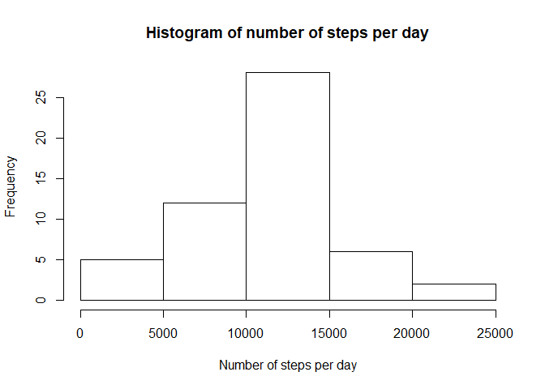
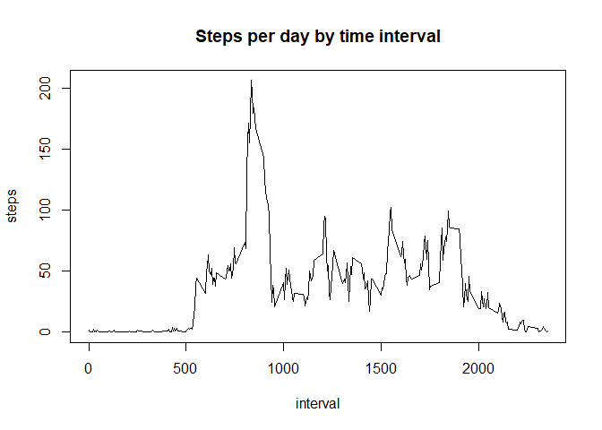
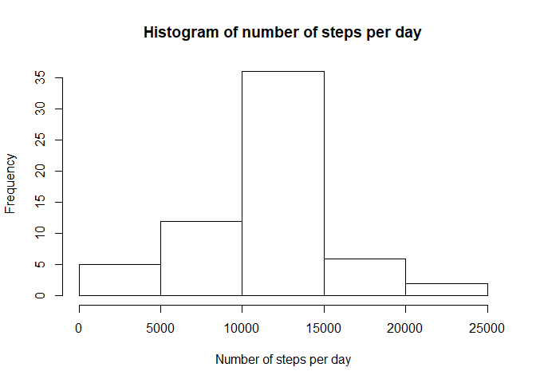
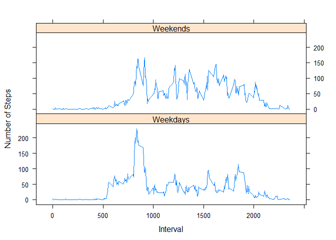

## Loading and preprocessing the data

Assuming the datafile has been unzipped and we're in the proper working directory, we can simply use the standard R "read.csv" function to load in the data, as follows:

```r
activity_table<-read.csv('activity.csv',header=TRUE,sep=',')
class(activity_table$date)
```

```
## [1] "factor"
```
The careful observer will notice that the 'date' column in our newly loaded table is currently set as a factor variable. We'll use the 'lubridate' package (conveniently loaded in the setup portion of our .Rmd) and a quick transformation to turn these into date objects for later use. We can easily verify that this transformation was successful with a call to 'class'.

```r
activity_table$date<-as_date(activity_table$date)
class(activity_table$date)
```

```
## [1] "Date"
```
Now we have a table with variables in the correct formats, and can continue our analysis.

## What is mean total number of steps taken per day?

First, we need to add up the steps taken on each day. We'll use some functions from the 'dplyr' package to get totals of steps for each day, first filtering out days with missing/NA values for 'steps'.

```r
by_date<-activity_table %>% filter(!is.na(steps)) %>% group_by(date) %>% summarize(steps=sum(steps))
```
We can make a quick histogram of the number of steps per day:

```r
hist(by_date$steps,xlab='Number of steps per day',main='Histogram of number of steps per day')
```

<!-- -->

We can now simply calculate the mean and median:

```r
meansteps<-as.numeric(mean(by_date$steps))
medsteps<-as.numeric(median(by_date$steps))
```
So our mean number of steps per day is simply: 10766.19.   
And the median is: 10765

## What is the average daily activity pattern?

Now we need to examine the steps taken per 5-minute interval averaged across all days. We can use a similar method as when we were interested in the steps per day, again filtering out NA values to avoid errors:

```r
by_interval<-activity_table %>% filter(!is.na(steps)) %>% group_by(interval) %>% summarize(steps=mean(steps))
```

Now we can plot the average number of steps vs. the interval:

```r
plot(steps~interval,data=by_interval,type='l',main='Steps per day by time interval')
```

<!-- -->

We're interested in which interval contains the most steps on average. We can find that fairly simply:

```r
maxID<-which.max(by_interval$steps)
```

So, the interval with the most steps on average is the one starting at minute 835 (corresponding to 8:35-8:40 AM), with an average of 206.17 steps.

## Imputing missing values

Now, we'd like to deal with all of our 'NA' values from the original data, instead of simply ignoring them. First, let's figure out how many 'NA' entries we have in the dataset.

```r
nacount<-sum(is.na(activity_table$steps))
```
So we have 2304 'NA' entries in our data. Since there are 17568 total entries, this represents a relatively small fraction of the data. Still, it would be nice to fill these in with something instead of just dropping them from the dataset. A simple yet reasonably robust way to do this would be to assign to each 'NA' value the average value of 'steps' for that interval across all days. Since we have created a table of intervals and their average step value already, this should be pretty straightforward. We can simply construct a for loop to go through each row of our main table ('activity_table') and replace any 'NA' entries in the 'steps' column with their corresponding value from the 'by_interval' table constructed earlier.


```r
imputed_table<-copy(activity_table)
for (i in 1:length(imputed_table$steps)){
  if (is.na(imputed_table$steps[i])){
    interval<-imputed_table$interval[i]
    imputedsteps<-by_interval$steps[by_interval$interval==interval]
    imputed_table$steps[i]<-imputedsteps
    }
}
```

We can verify whether this worked by checking that there are no longer any missing values in our imputed table:

```r
complete_imputed<-sum(complete.cases(imputed_table))
```
We see that we have 17568 complete fields in our table, which matches the total number of entries. Now we can plot a histogram and find the mean and median number of steps per day using our imputed data, essentially repeating our work from the beginning of this analysis:

```r
by_date_imputed<-imputed_table %>% group_by(date) %>% summarize(steps=sum(steps))
```
We can make a quick histogram of the number of steps per day:

```r
hist(by_date_imputed$steps,xlab='Number of steps per day',main='Histogram of number of steps per day')
```

<!-- -->

We can now simply calculate the mean and median:

```r
meansteps_imp<-as.numeric(mean(by_date_imputed$steps))
medsteps_imp<-as.numeric(median(by_date_imputed$steps))
```
So our mean number of steps per day is simply: 10766.19.   
And the median is: 10766.19.  
So we can see that while the mean number of steps per day remains unchanged, the median has increased by about one step per day. Overall, this method of imputing missing data has changed the estimates of total steps per day very minimally. This isn't terribly surprising, since when we initially calculated these estimates we had filtered out the missing data, and our method of imputation added back that data in a pattern matching the means of the remainder of our dataset. Additionally, we were only imputing a small fraction of the entries (13.11%) which helps to minimize any effects of the imputation.

## Are there differences in activity patterns between weekdays and weekends?

Finally, we're interested in exploring the difference in activity patterns between weekdays and weekends. In order to examine this potential difference, we must first separate our dates into weekdays and weekends. Luckily, R contains a function 'weekdays' that can determine the day of the week that a particular date falls on. So we'll start by identifying the weekday of each date, then sort into weekdays vs. weekends. We can append all of this calculated information using the 'mutate' tool in the 'dplyr' package.


```r
imputed_table_days<-imputed_table %>% mutate(day=weekdays(date))
weekdayslist<-c('Monday','Tuesday','Wednesday','Thursday','Friday')
imputed_table_wkend<-imputed_table_days %>% mutate(weekday=factor(ifelse(day %in% weekdayslist,'Weekday','Weekend')))
```

Now we can produce a time-series plot of the mean number of steps per interval. We'll reuse some of our earlier code to group our data by interval after splitting it into weekday and weekend sets.

```r
weekday_by_interval<-imputed_table_wkend %>% filter(weekday=='Weekday') %>% group_by(interval) %>% summarize(steps=mean(steps))
weekend_by_interval<-imputed_table_wkend %>% filter(weekday=='Weekend') %>% group_by(interval) %>% summarize(steps=mean(steps))
```

Now that we have our data nicely separated, we will create a plot object for each and assemble them into a two-panel plot using the 'lattice' graphics package.


```r
weekdayplot<-xyplot(steps~interval,weekday_by_interval,type='l',xlab='Interval',ylab='Number of Steps')
weekendplot<-xyplot(steps~interval,weekend_by_interval,type='l',xlab='Interval',ylab='Number of Steps')
c(Weekdays=weekdayplot, Weekends=weekendplot, 
y.same=TRUE,layout=c(1,2))
```

<!-- -->

Just looking at the plots, we can see a few differences in activity patterns between weekends and weekdays. We see somewhat less activity in the early intervals on weekends, with a smaller spike in the morning (perhaps due to the lack of a commute to work?). There also seems to be somewhat more activity through the middle of the day (perhaps due being relatively inactive at work during weekdays) and a longer period of activity towards the end of the day (people do tend to be more active in the evenings/nights during weekends). Of course, this is all just informed speculation, and we would need to perform further analysis to see if these differences are significant or what their underlying causes may be.
